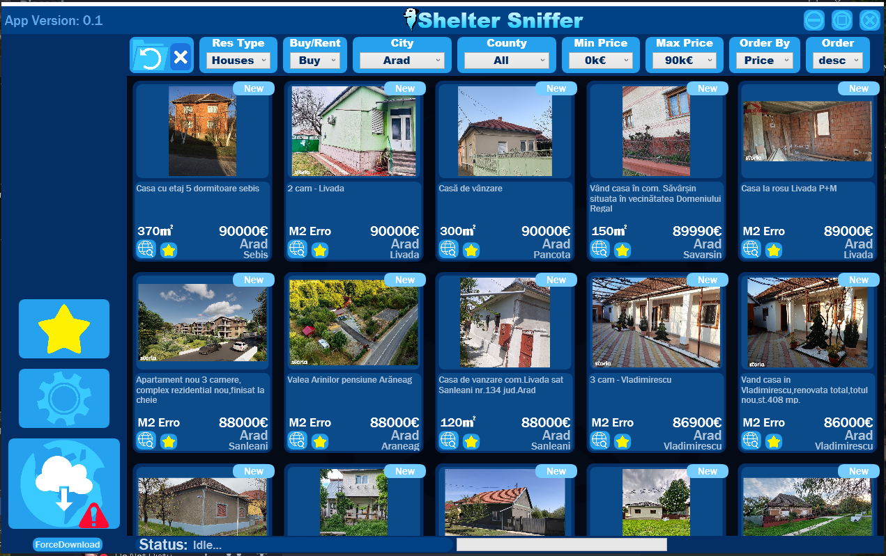

# ResidenceWebScraper

This is a webscraper that can webscrape multiple pages that you will need to add yourself using the example i gave.
It has multithreading,basic and advange filtering based on the information in the local data base, it uses that information to filter what the user has seen and has not seen, and it can notify the user when residence he already seen has changed in price, it also has the ability to add residences to favorite for easy acces.

You are responsable on how you use this app and remember you need to recive permision from any website you wish to target.
This is more for learning, be responsable with it.

